今天的议程
---

- Rust 语言概述
- Rust 语言优势/特点
- 实际应用案例
<!-- end_slide-->

锈 (Rust)
---

```rust
xiu::锈! {
    外 箱 锈;

    用 中::仓::典 作 典;

    性 键值 {
        函 写(&身, 键: 串, 值: 串);
        函 读(&身, 键: 串) -> 果<或<&串>, 串>;
    }

    静 变 籍: 或<典<串, 串>> = 无;

    构 实;

    阐 键值 为 实 {
        函 写(&身, 键: 串, 值: 串) {
            定 书 = 危 {
                籍.取入(标::准)
            };
            书.入(键, 值);
        }

        函 读(&身, 键: 串) -> 果<或<&串>, 串> {
            若 定 有(书) = 危 { 籍.作引() } {
                好(书.取(&键))
            } 否则 {
                错("未之有也".进())
            }
        }
    }
}
```
[](https://github.com/lucifer1004/xiu)
<!-- end_slide-->

Stackoverflow 问卷连续 8 年成为最受开发者喜爱的语言
---


<!-- end_slide-->

Rust 是什么?
---

# Rust 是一种**多范式**，通用的编程语言，主要强调性能，安全和并发性

- compiled language 编译语言
- 支持多种编程风格，例如： functional programming, OOP (不是 JAVA OOP), 等
- 适用于从系统编程到网络编程，从 embedded system 到游戏开发的各种应用
- 最初作为 C 和 C++的更安全替代品而设计
- 一种静态型语言，variable 和 expression 都在编译时确定和检查，这有助于增强内存安全和错误检测，从而实现更可靠的构建
<!-- end_slide-->

为什么选择 Rust？？？
---
- 开源
- 高性能
- 无GC
- 安全保证
- Ecosystem
  - Rust的包管理器和构建工具都由cargo 负责，极大简化了项目构建和依赖管理
- 无畏并发
- 零成本抽象
- 跨平台开发

<!-- end_slide-->

Rust vs JS 生态
--- 
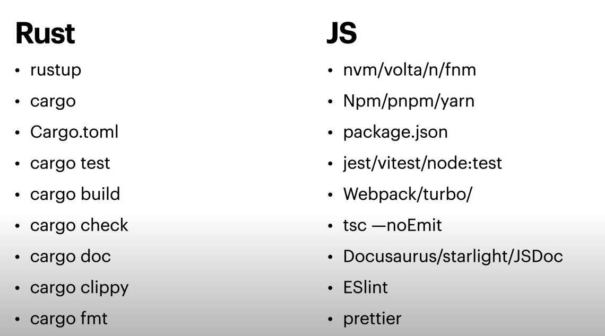

来源: [](https://youtu.be/dZQMoEWe5uY?si=-ESTScHm2smePzXj) 

<!-- end_slide-->

谁用Rust？
---
- Linux kernel
- Microsoft
- Google (Android)
- AWS 
- Huawei
- Discord
- Cloudflare
- 1Password
- Coursera
- Dropbox
- Facebook
- Figma

本土公司
---
- Mindvalley
- BigPay
- Decube

<!-- end_slide-->

你好，世界
---
```rust
    fn main() {
        println!("Hello,world!");
    }
```
<!-- end_slide-->

Stack(栈) vs Heap(堆)
---
# Stack
- 自动管理。函数调用时allocate，函数结束时释放
- Allocation 的速度较快，内存访问的速度通常也比heap来得快
- 用于储存variable，function parameter 等
- Variable 的生命周期通常与函数调用相关联

# Heap
- 手动管理。需要时分配，用完时需释放
- Allocation 的速度较慢，内存访问速度比Stack来得更慢
- 用于储存生命周期长或者大小大于heap的限制的数据
- 数据的生命周期又程序员控制，可跨函数调用存在

## Rust 储存在Stack的type有:
- i32 
- f64
- char
- bool
- &str

## Rust 储存在Heap的type有:
- Vec\<T\>
- String
- HashMap\<K,V\>
- Box\<T\>
- Arc\<T\>
- &str


<!-- end_slide-->

Ownership & Borrowing (借钱还钱)
--- 
## Ownership
想象一下，你从银行贷款买了一辆车。在这个情况下： 
- *你是车的拥有者，那辆车属于你的*。同样的，在Rust中，每个值都有一个持有者，比如变量，在Rust中，每个值只同时间只可以有一个持有者。
- *当你不再需要车时，你必须归还*。类似的，在Rust中，当一个变量离开领域(scope)时，它所拥有的内存会自动被解放，就像你把车归还后，不再对车负有责任。

## Borrowing
现在假设你的朋友想要借用你的车去购物，在这种情况下: 
- *你的朋友可以使用车但并不代表拥有它*。这就像在Rust中“借用”一个值。你的朋友可以驾车，
但是拥有权还在你这里。
- *同时，你不能用那辆车，也不能卖车*。这意味着当你的朋友使用车时，你不能做任何改变车的所以权决定。
在Rust中，这保证了当有人“借用”你的数据时，原始数据不能被修改或删除。 

<!-- end_slide-->

Javascript 例子1
--- 
```javascript
function pop(arr) {
    arr.pop()
}

const arr = [1,2,3,4];
const lastItem = arr[arr.length-1];

console.log({arr});

pop(arr);

console.log({arr,lastItem});
```

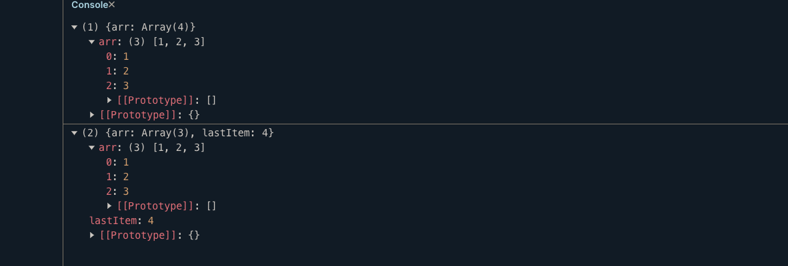

<!-- end_slide -->

Rust 例子1
---
```rust
pub fn pop(a: Vec<i32>) {
    a.pop();
}

fn main() {
    let mut test = vec![1, 2, 3];
    let last = test.last().unwrap();
    pop(test);
    println!("{last}");
}
```

<!-- end_slide -->

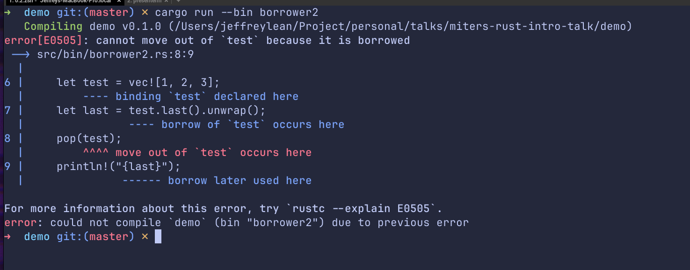

<!-- end_slide -->

Rust 方案
---
```rust
pub fn pop(a: &mut Vec<i32>) {
    a.pop();
}

fn main() {
    let mut test = vec![1, 2, 3];
    pop(&mut test);
    let last = test.last().unwrap();
    println!("{last}");
}
```

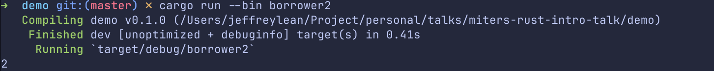

<!-- end_slide -->

Javascript 例子2
--- 

```javascript
    function borrowCarToIvan(car) {
       car.owner = "Ivan";
       console.log(`Car is belong to ${car.owner} now.`);
    }

    function paintCar(car) {
        car.color = "blue";
        console.log(`Car is now in ${car.color}`)
    }

    let myCar = {color: "red",owner: "Jeff"};
    console.log(`Car is belong to ${myCar.owner}`)

    borrowCarToIvan(myCar);
    paintCar(myCar);

    console.log(`Car is belong to ${myCar.owner} and in color ${myCar.color}`);

```
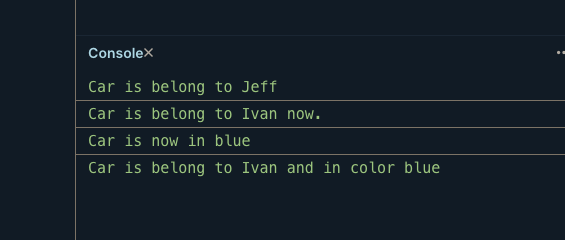

<!-- end_slide -->


Rust 例子2
--- 
```rust
#[derive(Debug)]
struct Car {
    owner: String,
    color: String,
}

fn borrow_car_to_ivan(mut car: Car) {
    car.owner = String::from("Ivan");
    println!("Car is belong to {} now.", car.owner);
}

fn paint_car(mut car: Car) {
    car.color = String::from("blue");
    println!("Car is now in {}", car.color);
}

fn main() {
    let mut my_car = Car {
        color: String::from("red"),
        owner: String::from("Jeff"),
    };

    println!("Car is belong to {}", my_car.owner);
    borrow_car_to_ivan(my_car);
    paint_car(my_car);

    println!(
        "Car is belong to {} and in color {}.",
        my_car.owner, my_car.color
    )
}

```

<!-- end_slide -->
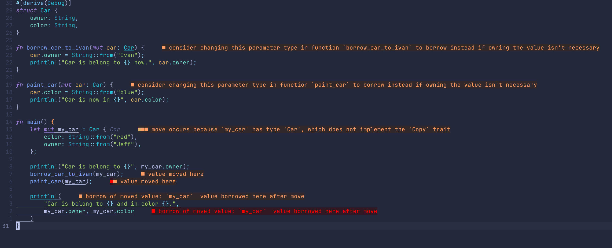

<!-- end_slide -->

方案1
---
```rust
#[derive(Debug, Clone)]
struct Car {
    owner: String,
    color: String,
}

fn borrow_car_to_ivan(mut car: Car) {
    car.owner = String::from("Ivan");
    println!("Car is belong to {} now.", car.owner);
}

fn paint_car(mut car: Car) {
    car.color = String::from("blue");
    println!("Car is now in {}", car.color);
}

fn main() {
    let my_car = Car {
        color: String::from("red"),
        owner: String::from("Jeff"),
    };

    println!("Car is belong to {}", my_car.owner);
    borrow_car_to_ivan(my_car.clone());
    paint_car(my_car.clone());

    println!(
        "Car is belong to {} and in color {}.",
        my_car.owner, my_car.color
    )
}

```
<!-- end_slide -->

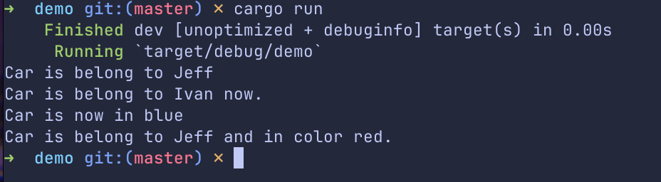

<!-- end_slide -->

方案2
---

```rust
#[derive(Debug)]
struct Car {
    owner: String,
    color: String,
}

fn borrow_car_to_ivan(car: &mut Car) {
    car.owner = String::from("Ivan");
    println!("Car is belong to {} now.", car.owner);
}

fn paint_car(car: &mut Car) {
    car.color = String::from("blue");
    println!("Car is now in {}", car.color);
}

fn main() {
    let mut my_car = Car {
        color: String::from("red"),
        owner: String::from("Jeff"),
    };

    println!("Car is belong to {}", my_car.owner);
    borrow_car_to_ivan(&mut my_car);
    paint_car(&mut my_car);

    println!(
        "Car is belong to {} and in color {}.",
        my_car.owner, my_car.color
    )
}

```

<!-- end_slide -->

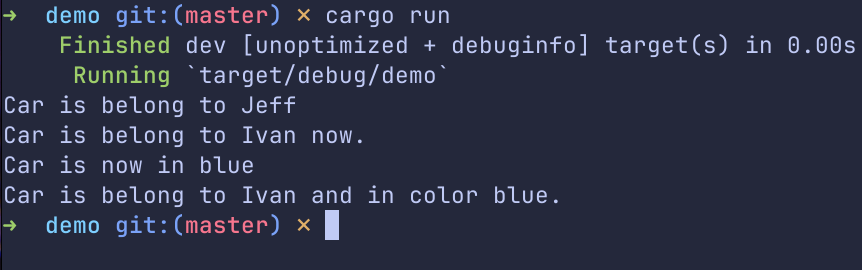

<!-- end_slide -->

Lifetime
---
- Lifetime 是Rust中的一个特性，用于确保引用始终有效。可以防止dangling pointer 和race condition 等问题
- 生命周期标记引用的有效范围，帮助Rust编译器理解引用何时有效

语法： 

```rust
&'a str

``` 

<!-- end_slide -->
```rust
fn main() {
    let r;

    {
        let x = 5;
        r = &x;
    }

    println!("r: {}", r);
}
```

<!-- end_slide -->

# dangling pointer 悬空指针
C
---
```c
const char* result;
{
    char s1[] = "Short";
    char s2[] = "A longer string";
    result = longest_str(s1, s2);
}  // s1 and s2 go out of scope here

// result is now a dangling pointer
printf("%s", result);  // Undefined behavior!

```
javascript
---
```javascript
function longestStr(s1, s2) {
    // This function returns a reference to one of the input strings
    return s1.length > s2.length ? s1 : s2;
}

function createLongestStr() {
    let string1 = "I will disappear soon";
    let string2 = "I will stick around for a while";

    return longestStr(string1, string2);
}

let longest = createLongestStr();

// Later in the code...
console.log(longest);  // Outputs: I will stick around for a while
```

<!-- end_slide -->

```rust
fn longest_str(s1: &str, s2: &str) -> &str {
    if s1.len() > s2.len() {
        s1
    } else {
        s2
    }
}

fn main() {
    let string1 = "short".to_string();
    let string2 = "longggg".to_string();
    let result = longest_str(&string1, &string2);
    println!("The longest string is {}", result);
}

```
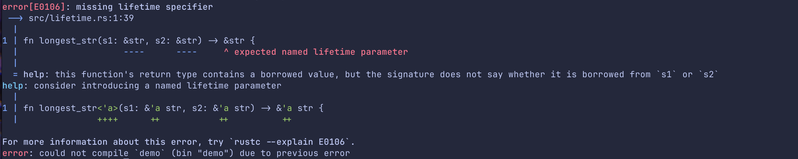

<!-- end_slide -->

```rust
fn longest_str<'a>(s1: &'a str, s2: &'a str) -> &'a str {
    if s1.len() > s2.len() {
        s1
    } else {
        s2
    }
}

fn main() {
    let string1 = "short".to_string();
    let string2 = "longggg".to_string();
    let result = longest_str(&string1, &string2);
    println!("The longest string is {}", result);
}
```
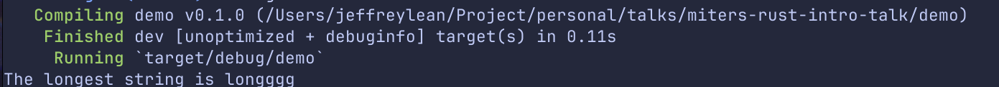

<!-- end_slide -->

Enumeration
---

```rust
enum Error {
    Aborted,
    NotFound(String),
    Internal{code:u32,msg: String},
}
```
Rust的Enum是一种强大的功能，它允许你通过enumerating一系列可能的variant来定义一个type。与其他一些语言中的enum不同，Rust 的enum可以在每个variant中存储不同类型和数量的数据。
<!-- end_slide -->

Pattern matching
---
Rust的pattern matching超强大，是我个人超喜欢Rust的其中一个feature。
`match` expression是一种基于enum variant来控制流程的方式。

```rust
enum Error {
    Aborted,
    NotFound(String),
    Internal { code: u32, msg: String },
}

fn handle_error(error: Error) {
    match error {
        Error::Aborted => {
            println!("Operation was aborted");
        }
        Error::NotFound(item) => {
            println!("Item not found: {}", item);
        }
        Error::Internal { code, msg } => {
            println!("Internal Error - Code: {}, Message: {}", code, msg);
        }
    }
}

fn main() {
    let error1 = Error::NotFound(String::from("file.txt"));
    handle_error(error1);

    let error2 = Error::Internal {
        code: 500,
        msg: String::from("Server error"),
    };
    handle_error(error2);

    let error3 = Error::Aborted;
    handle_error(error3);
}
```
<!-- end_slide -->
Exhaustive checking
---
# 当我们用`match`来对enum进行匹配时，为了保证完整性和确保安全性，我们必须确保处理Enum中的所以可能的variant，否则compiler 会发脾气。这是为了确保你考虑到所有可能的情况，这样可以防止运行时出现不必要的行为。
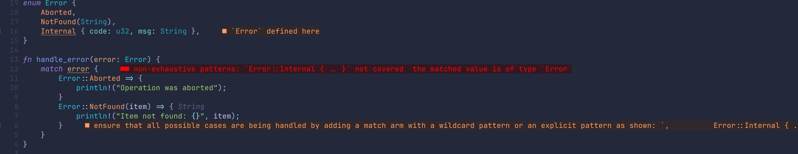
<!-- end_slide -->

Wildcard
---
# 如果我们无需处理所有的变体，我们也可以用`_`符号来表示处理剩下的变体。
```rust
enum Error {
    Aborted,
    NotFound(String),
    Internal { code: u32, msg: String },
    ClientError,
}

fn handle_error(error: Error) {
    match error {
        Error::Aborted => {
            println!("Operation was aborted");
        }
        Error::NotFound(item) => {
            println!("Item not found: {}", item);
        }
        Error::Internal { code, msg } => {
            println!("Internal Error - Code: {}, Message: {}", code, msg);
        }
        _ => (),
    }
}
```
<!-- end_slide -->

Traits
---
# Rust的Traits是一种让不同type可以共享行为的方法
类似于其他语言的接口，可以用来达成 polymorphism 或 abstraction

<!-- end_slide -->

定义trait
---
# 使用 trait 关键字定义trait，后跟一组signature
```rust
trait Shape {
    fn area(&self) -> f64;
}
```
<!-- end_slide -->

implement(实现) trait
---
# 可以使用 impl 关键字为任何type实现特质
```rust
struct Circle {
    radius: f64,
}

impl Shape for Circle {
    fn area(&self) -> f64 {
        consts::PI * self.radius * self.radius
    }
}
```
<!-- end_slide -->
```rust
use std::f64::consts;

trait Shape {
    fn area(&self) -> f64;
}

struct Circle {
    radius: f64,
}

impl Shape for Circle {
    fn area(&self) -> f64 {
        consts::PI * self.radius * self.radius
    }
}

struct Square {
    side: f64,
}

impl Shape for Square {
    fn area(&self) -> f64 {
        self.side * self.side
    }
}

fn main() {
    let circle = Circle { radius: 5.0 };
    let square = Square { side: 5.0 };

    println!("Area of circle: {}", circle.area());
    println!("Area of square: {}", square.area());
}
```
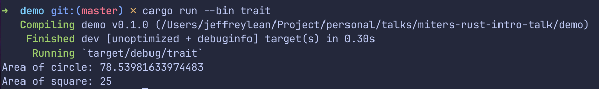
<!-- end_slide -->

Error handling
---
- Rust的错误处理不是传统的try-catch，而是把Error当value来看待，这和Golang相识
- Rust的错误处理方式算是最吸引人的特点之一，强调安全性，和可预测性
- Rust 将error 分为两大类： 
    - Unrecoverable error (不可恢复错误)
    - Recoverable error (可恢复错误)

<!-- end_slide -->

Unrecoverable error
---
- 可以使用`panic!`来处理。使用`panic!`将终止程序并提供错误信息
- 一般而言，只在测试或继续运行意味着损坏数据或引起更多问题的情况下使用`panic!`
```rust
fn get_element(v: Vec<i32>, index: usize) {
    if index >= v.len() {
        panic!("panic with overflow：{}", index);
    }
    println!("{}", v[index]);
}

fn main() {
    let list = vec![1, 2, 3, 4];
    get_element(list, 5);
}
```
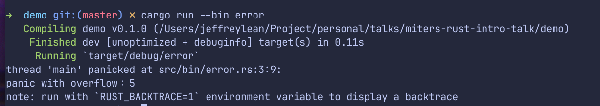

<!-- end_slide -->

Recoverable error
---
# 可恢复错误通常使用`Result<T,E>`enum 来处理
## 这就是所谓的Rust看待Error as value，每一个函数的返回类型应该应用`Result`。 这允许调用者根据返回的 Result 做出相应的处理，无论是处理成功的结果还是处理错误。
```rust
enum Result<T,E> {
    Ok(T),
    Err(E),
}
```
<!-- end_slide -->

Error handling例子 - unwrap
---
```rust
fn read_file_contents_with_unwrap(path: &str) -> Result<String, Box<dyn Error>> {
    let mut file = File::open(path).unwrap();
    let mut contents = String::new();
    file.read_to_string(&mut contents)?;
    Ok(contents)
}

fn main() -> Result<(), Box<dyn Error>> {
    let path = "example.txt";

    match read_file_contents_with_auto_handle(path) {
        Ok(contents) => println!("File contents: \n{}", contents),
        Err(e) => println!("Failed to read the file: {}", e),
    }

    Ok(())
}
```
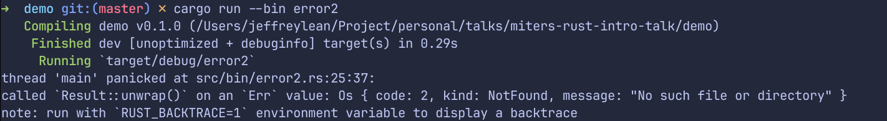

<!-- end_slide -->

Error handling例子 - pattern matching
---
```rust
fn read_file_contents_with_pattern_matching(path: &str) -> Result<String, Box<dyn Error>> {
    let mut file = match File::open(path) {
        Ok(f) => f,
        Err(err) => return Err(Box::new(err)),
    };
    let mut contents = String::new();
    file.read_to_string(&mut contents)?;
    Ok(contents)
}

fn main() -> Result<(), Box<dyn Error>> {
    let path = "example.txt";

    match read_file_contents_with_pattern_matching(path) {
        Ok(contents) => println!("File contents: \n{}", contents),
        Err(e) => println!("Failed to read the file: {}", e),
    }

    Ok(())
}
```
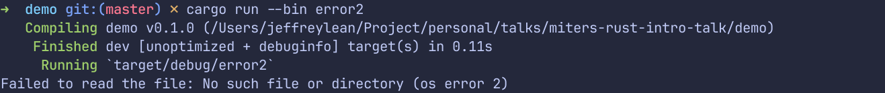

<!-- end_slide -->

Error handling例子 - auto `?`
---
```rust
fn read_file_contents_with_auto_handle(path: &str) -> Result<String, Box<dyn Error>> {
    let mut file = File::open(path)?;
    let mut contents = String::new();
    file.read_to_string(&mut contents)?;
    Ok(contents)
}

fn main() -> Result<(), Box<dyn Error>> {
    let path = "example.txt";

    match read_file_contents_with_auto_handle(path) {
        Ok(contents) => println!("File contents: \n{}", contents),
        Err(e) => println!("Failed to read the file: {}", e),
    }

    Ok(())
}
```


<!-- end_slide -->

在Rust编写测试
---
测试是软件开发的重要部分，确保代码按预期运行。Rust 强调安全性和可靠性，为编写测试提供了极好的支持。Rust 的built-in测试框架容易使用，无需特地setup。

# 基本测试结构
## Rust 中的基本测试是带有`#[test]`的annotaion。以下的测试function确定某些条件被满足，才可以通过测试。
```rust
pub fn addition(a: i64, b: i64) -> i64 {
    a + b
}
fn main() {
    let a = 1;
    let b = 1;
    println!("{}+{}={}", a, b, addition(a, b))
}
#[cfg(test)]
mod tests {
    use crate::addition;

    #[test]
    fn test_addition() {
        assert_eq!(addition(1, 1), 2);
    }
}
```
<!-- end_slide -->

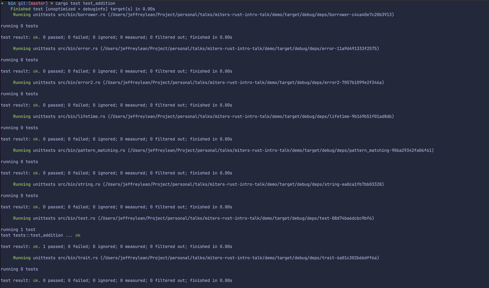

<!-- end_slide -->

Rust的缺点
---
- 构建/编译时间较长
- 曲折的学习曲线
- Ecosystem 还不是很成熟

<!-- end_slide -->

Golang Malaysia, feat Rustlang.... (Telegram)
---


<!-- end_slide -->

Rust Malaysia (Facebook)
---


<!-- end_slide -->

RustAsean (Discord)
---

